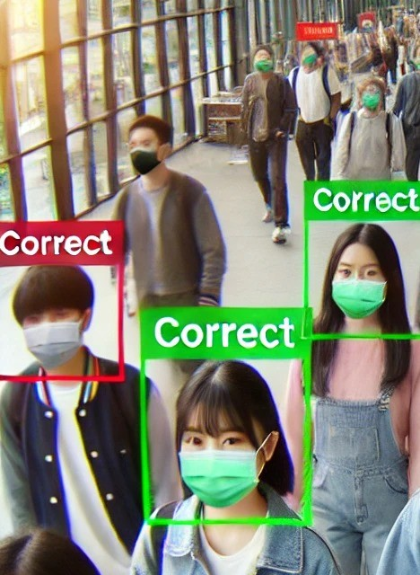

# Active Face Mask Detection - Winter in Data Science

## Description

The Active Face Mask Detection project aims to develop a real-time system that monitors individuals in CCTV footage to determine if they are wearing face masks, in alignment with Covid-19 safety protocols and public safety regulations. Designed to introduce you to essential machine learning concepts through a practical, hands-on approach, this project guides you step-by-step, making it accessible even if you’re new to the field. With just a curiosity to learn, you’ll gain foundational skills in computer vision and real-time video analysis. From understanding the basics of face detection to building a model that identifies mask compliance, this project offers a complete experience that’s as educational as it is relevant to today’s public health needs.

## Prerequisites

1. **CS101 Course**
2. **Basic understanding of Python**: Understanding variables, loops, and functions will be helpful.
3. **Familiarity with Data-analysis Libraries** _(optional)_: A basic idea of libraries like NumPy, OpenCV, and Matplotlib is a bonus but not mandatory.
4. **Curiosity, Enthusiasm and commitment**

## Note:

1. Each assignment comes with pre-written comments and some initial code. You only need to fill in the designated blank spaces for the basic assignments.  
2. Please do not make any changes to the code outside the designated areas. This will make it easier for us to evaluate your work.  
3. A submission form will be released every week. You must submit the completed assignment before the deadline.  
4. Focus on learning as much as possible. Developing a deep and smart understanding will help you when writing code.  
5. Do not use any AI tools to complete the assignments. Write all the code yourself from scratch (if needed).  
6. These exercises are designed to help you develop a clear understanding of the concepts. You are free to refer to any resources on the internet, except for answers generated by normalised GPT models. 😉  

Cheers!  
Happy Learning and Coding!  

---

## Week 1: Introduction to Image Processing and Data Handling

### Goals

1. Understand the basics of image processing and computer vision.
2. Learn how to handle and preprocess image data.
3. Get comfortable with essential libraries like OpenCV, NumPy, and Matplotlib.

### Assignments

1. **NumPy Array Manipulations**: Write a program to convert an image to a NumPy array and explore basic operations to understand pixel data.
2. **Basic Image Manipulation with OpenCV**: Write a simple program to load, display, and save images using OpenCV and try some simple image operations(like converting images to grayscale, resizing, and flipping images).
3. **Organizing Data**: Practice organizing images into labeled folders (e.g., `with_mask` and `without_mask`).

4. **_Bonus_**: Create a short script to load a batch of images, resize them to 128x128, and convert them to grayscale.

### Resources

1. **NumPy**: https://www.youtube.com/watch?v=QUT1VHiLmmI
2. **Matplotlib**: https://www.youtube.com/watch?v=OZOOLe2imFo
3. **Image Processing playlist**: https://www.youtube.com/playlist?list=PLKnIA16_RmvYXDBJ5WRDuQRSzFJs93pYR

## Week 2: Basics of Neural Networks and Building a Simple CNN

### Goals
1. Learn the basics of neural networks and Convolutional Neural Networks (CNNs).
2. Implement a simple CNN model for binary classification (with mask vs. without mask).
3. Use Keras (or PyTorch if you’re comfortable) to build and train the model.

### Assignments

1. **Learn CNN Concepts**: Watch a beginner-friendly tutorial on neural networks and CNNs to understand concepts like convolution, pooling, and fully connected layers.

2. **Build a CNN Model**: Write a program to create a CNN model using Keras, focusing on basic layers like `Conv2D`, `MaxPooling2D`, `Flatten`, and `Dense`.

3. **Train the Model**: Train your model on the preprocessed data, monitor training loss and accuracy, and save the model.

4. ***Bonus***: Preprocess and Train on Dataset
Write a small program to load images, preprocess them, and train your CNN model to distinguish between images with and without masks.

## Week 3: Model Evaluation, Testing, and Real-Time Detection with OpenCV

### Goals
1. Evaluate your model's performance and test it on new images.
2. Implement real-time mask detection using your webcam and OpenCV.
3. Explore basic deployment ideas if you have time.

### Assignments

1. **Model Evaluation**: Evaluate your trained model on a test set and calculate accuracy, precision, recall, and F1-score. Write a script to plot the model’s training and validation loss and accuracy.

2. **Real-Time Detection with OpenCV**: Load the trained model and use it to classify faces from a live video stream. Use OpenCV’s `VideoCapture` to access the webcam and `CascadeClassifier` to detect faces in each frame.

3. ***Bonus***: Explore deploying the model in a web app using Flask if time allows. Research how to serve the model as an API and process image data.

## Week 4: Putting it together!

### Goals
1. Combine all the functionalities into a single application.
2. Test the application thoroughly and fix any issues.
3. Prepare a presentation or report summarizing your project, including challenges faced and solutions implemented.

### Assignments

1. **Integration**: Combine the model evaluation, real-time detection, and any other features you've implemented into one cohesive application.

2. **Testing**: Thoroughly test your application with different scenarios and datasets to ensure reliability and performance.

3. **Documentation**: Prepare documentation for your project, detailing the setup, usage instructions, and insights gained during the development process.

4. ***Bonus***: Create a simple user interface (UI) using a library like Tkinter or Flask to make your application more user-friendly. This could include buttons for starting and stopping the detection, displaying results, and showing live video feeds in a window.
